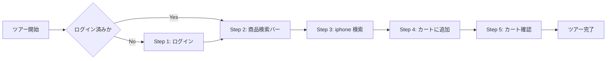

# Product Tour（ガイドツアー）機能要件定義

## 概要

初回訪問ユーザーやデモ利用者向けに、EC Demo の主要操作を順番に案内する Product Tour を提供する。  
ツアーは画面上の要素をハイライトし、吹き出しで「何をすればよいか」「その操作で何が起きるか」を説明する。

この文書は要件定義を目的とし、ライブラリ選定や詳細実装は実装方針として分離して記載する。

## 目的

- ログインからカート遷移までの主要導線を短時間で理解できるようにする
- Elasticsearch を使った商品検索とカート導線のデモ価値を分かりやすく伝える
- 初回利用時の離脱を減らし、手動説明なしでも操作を追える状態にする

## スコープ

- `apps/web` のログインからカート遷移までの画面内ガイド
- 画面遷移をまたぐツアー状態の維持
- 初回訪問時の自動起動、および手動再実行
- ツアー完了状態の保存

## 非スコープ

- 外部サービス認証の自動操作
- チェックアウト、実決済、決済完了画面のツアーへの組み込み
- 管理画面や会員登録フローの案内
- A/B テストや分析イベントの高度な最適化

## 想定ユーザーと前提

### 想定ユーザー

- 初めて EC Demo を触る開発者
- デモ環境で購入フローを説明したい営業・開発メンバー
- 主要機能だけ短時間で把握したいレビュー参加者

### 前提条件

- `apps/web` が起動済みであること
- 商品検索が利用可能であること
- ログインと検索機能が利用可能であること

## ツアーフロー概要

ログイン済みかどうかで開始位置を切り替える。



## ツアーステップ要件

| Step | 画面 | ターゲット要素 | 完了条件 | 補足 |
|------|------|----------------|----------|------|
| 1 | `/login` | Google ログインボタン、補助的にログインフォーム | ログイン成功後に `/` へ遷移 | 未ログイン時のみ実施 |
| 2 | `/` | ヘッダーの検索バー | 「次へ」押下 | 検索機能の説明 |
| 3 | `/` | 検索入力欄、検索ボタン | 検索実行後に `/search?q=iphone` へ遷移 | `iphone` を例示 |
| 4 | `/search?q=iphone` | 最初の商品カードの「カートに追加」 | カート追加成功 | 検索結果画面の主要操作 |
| 5 | `/cart` | カート一覧、「レジへ進む」ボタン | カート到達と内容確認 | カート導線の理解をもって終了 |

### Step 1: ログイン

| 項目 | 内容 |
|------|------|
| 目的 | デモ利用時の推奨ログイン導線を理解させる |
| 説明文 | 「まずはログインしてください。デモでは Google ログインの利用を推奨します。メールアドレスまたは電話番号でのログインも利用できます。」 |
| UI 挙動 | Google ログインボタンを主対象としてハイライトし、必要に応じて通常ログインフォームも補足説明する |
| 次ステップ条件 | 認証成功後、トップページ表示を検知して Step 2 へ進む |

### Step 2: 商品検索バー

| 項目 | 内容 |
|------|------|
| 目的 | 検索が主要導線であることを伝える |
| 説明文 | 「商品検索から購入までの流れを案内します。まずは検索バーの使い方を確認しましょう。」 |
| UI 挙動 | 検索フォーム全体をハイライトし、検索対象が商品名・ブランド・カテゴリであることを説明する |
| 次ステップ条件 | ユーザーが「次へ」を押下 |

### Step 3: 検索キーワード入力

| 項目 | 内容 |
|------|------|
| 目的 | 実際に検索を実行して結果画面へ遷移させる |
| 説明文 | 「例として `iphone` を検索してみましょう。検索後に一覧画面へ移動します。」 |
| UI 挙動 | 入力欄をハイライトし、必要に応じて `iphone` のプリセット入力を許容する |
| 次ステップ条件 | `/search` への遷移と `q=iphone` の検知 |

### Step 4: 検索結果からカート追加

| 項目 | 内容 |
|------|------|
| 目的 | 検索結果画面で購入対象を選ぶ操作を理解させる |
| 説明文 | 「検索結果から商品を選び、カートに追加します。まずは最初の商品で流れを確認します。」 |
| UI 挙動 | 先頭商品カード内の CTA をハイライトする |
| 次ステップ条件 | ユーザーが「次へ」を押下した時点で先頭商品をカートへ自動追加し、`/cart` へ遷移する |
| 備考 | 検索結果ロード後に `registerStepAction(3, fn)` で自動追加アクションを登録する実装 |

### Step 5: カート確認

| 項目 | 内容 |
|------|------|
| 目的 | カート内容の確認とチェックアウト導線を示す |
| 説明文 | 「追加した商品はカートで確認できます。このツアーではここまでを対象とし、購入前の主要導線を確認して完了します。」 |
| UI 挙動 | 商品一覧を主対象として案内し、必要に応じて「レジへ進む」ボタンは次導線の参考として補足表示する |
| 次ステップ条件 | ツアー終了状態を保存する。完了後はカートページに留まる（`/` へのリダイレクトは行わない） |

## 受け入れ基準

| ID | 条件 |
|----|------|
| AC-01 | 未ログイン時は `/login` から、ログイン済み時は `/` からツアー開始できる |
| AC-02 | 画面遷移後も現在のステップを維持し、対応要素が表示された時点で再開できる |
| AC-03 | ターゲット要素が見つからない場合、ツアー全体が停止せず安全にスキップまたは中断できる |
| AC-04 | 初回訪問時に自動起動でき、手動トリガーから再実行できる |
| AC-05 | 完了後は `localStorage` に状態を保持し、意図せず毎回自動起動しない |
| AC-06 | モバイル表示でも吹き出しが画面外にはみ出さない |
| AC-07 | キーボード操作で `Esc` による終了、`Tab` によるボタン移動ができる |
| AC-08 | Step 1 では Google ログインを推奨導線として案内できる |

## UI/UX 要件

### 吹き出し

- タイトル、本文、ステップ番号、操作ボタンを含む
- ボタンは `戻る` `スキップ` `次へ` を基本とする
- 現在位置が分かるよう `N/M` を表示する
- ツアー対象要素との視線誘導が成立する位置に配置する

### オーバーレイ

- 背景は半透明で画面全体を覆う
- ターゲット要素のみ視認しやすくするスポットライト表現を付ける
- 他のモーダルやヘッダーより上に表示される `z-index` を持つ

### モバイル対応

- 画面幅が狭い場合は吹き出しを下部固定に切り替える
- ターゲット要素が画面外にある場合は自動スクロールする

## 実装方針

### ライブラリ方針

- 第一候補は `Driver.js`
- 要件を満たせない場合のみ自前実装を検討する
- 要件段階では特定ライブラリへの過度な依存を避ける

### 状態管理

- `apps/web/src/composables/useProductTour.ts` にツアー状態を集約する
- 現在ステップ、起動状態、完了状態、再開待ち状態を管理する
- `vue-router` の遷移フックと連携して画面跨ぎの再開を行う
- `registerStepAction(stepIndex, fn)` でステップ別のアクション（例：カート自動追加）を登録できる。アクションは「次へ」押下時に実行される

### 永続化

- `localStorage` に完了状態を保存する
- キーは他機能と衝突しないよう名前空間を付ける
- 例: `ec-demo.product-tour.completed`

### 起動トリガー

| トリガー | 条件 |
|---------|------|
| 初回訪問時 | 完了状態が未保存の場合に自動起動 |
| ヘッダーのヘルプ導線 | 任意タイミングで再実行 |
| URL パラメータ | `?tour=true` で明示的に起動 |

## セレクタ設計

`id` の乱立を避けるため、ツアー対象要素には `data-tour` 属性を付与する。

### 付与例

```html
<!-- App.vue -->
<form data-tour="search-form">
  <input data-tour="search-input" />
  <button data-tour="search-button" type="submit">検索</button>
</form>
<router-link data-tour="cart-link" to="/cart">カート</router-link>

<!-- LoginView.vue -->
<input data-tour="login-email" />
<input data-tour="login-password" />
<button data-tour="login-google">Googleでログイン</button>  <!-- Step 1 主ターゲット -->
<button data-tour="login-submit">ログイン</button>

<!-- SearchView.vue -->
<button data-tour="add-to-cart-primary">カートに追加</button>  <!-- 検索結果先頭商品のみ付与 -->

<!-- CartView.vue -->
<div data-tour="cart-items">...</div>
<button data-tour="checkout-button">レジへ進む</button>

<!-- PaymentDetailView.vue -->
<div data-tour="payment-qr">...</div>  <!-- ツアー外ヒント用（独立表示） -->
```

## ツアー外 UI ガイド

ツアーステップには含まれないが、ユーザーの操作を補助するため以下の画面で独立したガイドを提供する。

### カートページ：未ログイン時のレジ進行

| 項目 | 内容 |
|------|------|
| トリガー | 未ログイン状態で「レジへ進む」ボタンを押下 |
| UI 挙動 | ログイン促進モーダルを表示する（直接 `/login` へリダイレクトしない） |
| モーダル内容 | 「ログインが必要です」メッセージ、「ログイン」ボタン（`/login` 遷移）、「キャンセル」ボタン |

### 支払い詳細ページ：QRコード操作ヒント

| 項目 | 内容 |
|------|------|
| トリガー | QRコードの表示が確定した瞬間（`qrImgUrl` が非空になった時点）に1回だけ表示 |
| UI 挙動 | Driver.js で `[data-tour="payment-qr"]` をハイライトし、ポップオーバーを表示 |
| ポップオーバー内容 | 「paypay(developer mode)アプリでQRコードをスキャンしてお支払いください。」 |
| 備考 | ページ内フラグで重複表示を防止。ツアーの STEPS には含まない |

## 非機能要件

| 項目 | 要件 |
|------|------|
| パフォーマンス | ツアーライブラリは遅延読み込み可能であること |
| アクセシビリティ | 適切なラベル付けとキーボード操作を提供すること |
| 耐障害性 | ターゲット要素未検出時にアプリ本体の操作を阻害しないこと |
| 保守性 | 画面側のセレクタ変更影響を局所化できる構成であること |
| 多言語対応 | 文言を将来的に i18n へ切り出せる構造であること |

## テスト計画

| テスト種別 | 内容 |
|-----------|------|
| E2E | ツアー開始、ログイン後再開、カート到達、スキップ、完了保存を確認する |
| コンポーザブル単体 | ステップ遷移、条件分岐、永続化のロジックを確認する |
| 手動 | Chrome / Safari / Firefox で吹き出し位置とスポットライトを確認する |
| モバイル | 狭幅画面での下部固定表示、自動スクロール、タップ操作を確認する |

## リスクと確認事項

- 検索結果 0 件時の代替導線を別途決める必要がある
- ログイン済みユーザーの開始ステップを Step 2 にするか、Step 1 を説明のみでスキップするかは実装時に最終確定する

## 参考リンク

- [Driver.js 公式ドキュメント](https://driverjs.com/)
- [Shepherd.js](https://shepherdjs.dev/)
- [Vue 3 Teleport](https://vuejs.org/guide/built-ins/teleport.html)
